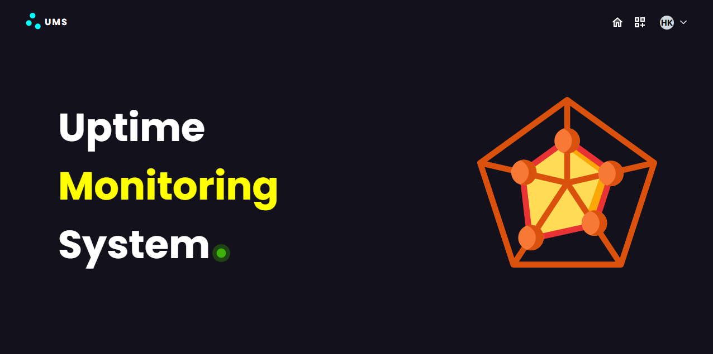
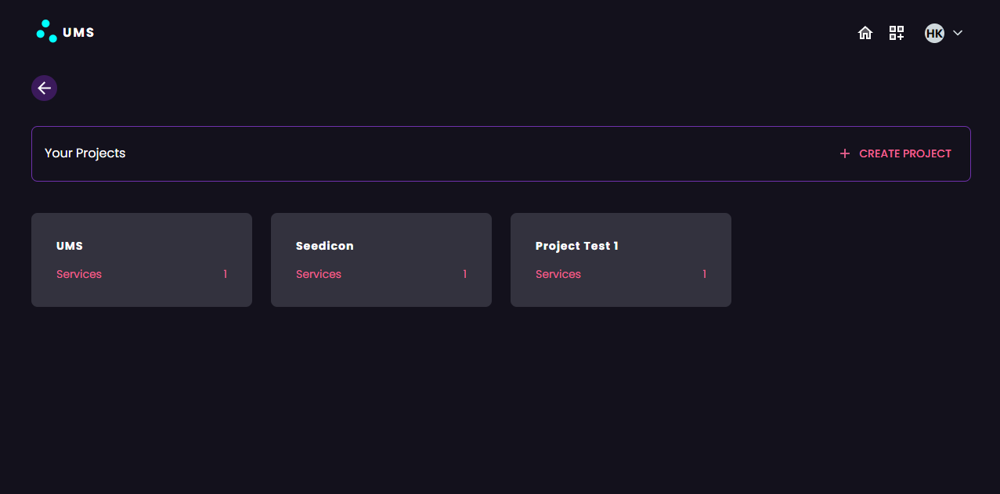
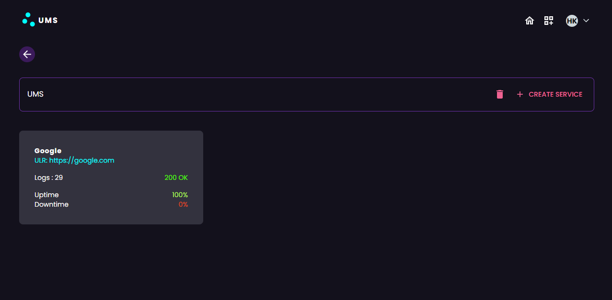
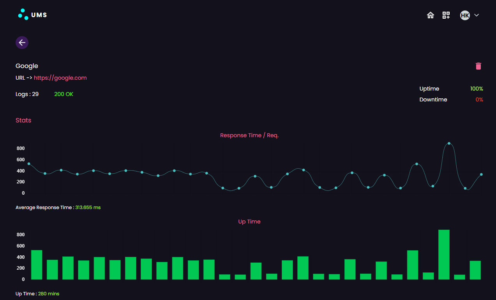

## Uptime Monitoring System (UMS)

#### STACK : MERN

#### FRONTEND : Vite

#### BACKEND : NodeJS

#### UI Framework : MUI

##### Overview

Live Link: https://uptime-monitoring-system.vercel.app/

##### Home

##### Dashboard

##### Services

##### Stats for Service

